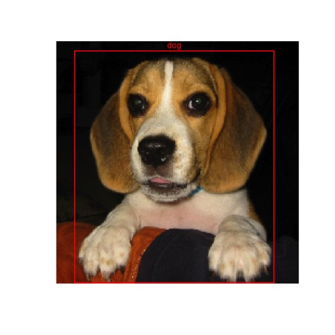
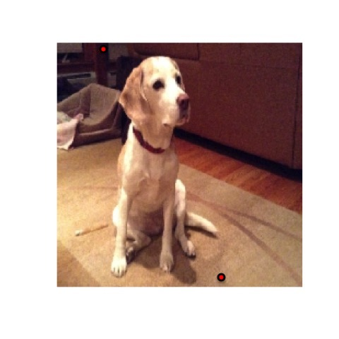
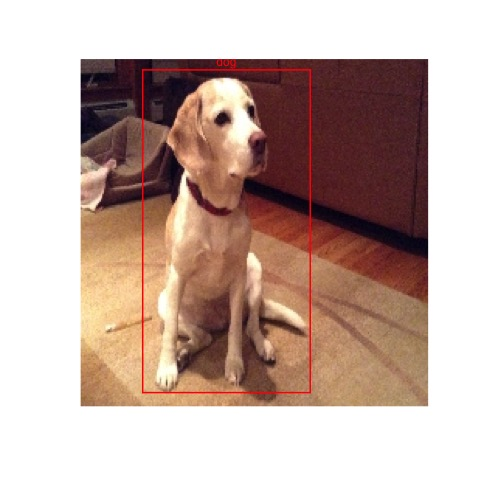

<!-- README.md is generated from README.Rmd. Please edit that file -->
boundingbox
===========

Select points or sets of points on an image to generate bounding boxes.

Installation
------------

**boundingbox** can be installed from Github.

### Github

``` r
library(devtools)
install_github("stomperusa/boundingbox")
```

Examples
--------

The **boxer** function allows you to stream through images and select between 2 and 26 points around which a bounding box is generated in each image. You can set a common classifier for all of the images.

``` r
box_coords <-
    boxer(
    names = c("S2.jpg", "W1.jpg"),
    file_path_input = system.file("extdata",    package = "boundingbox"),
    file_path_output = tempdir(),
    classifier = "dog",
    show_classifier = TRUE,
    resize_x = 224,
    resize_y = 224,
    outbox = TRUE
    )
```

When an image appears, use the left mouse button to select a point, and the right mouse button to signal completion and to move to the next image. To skip through any of the images, use the right mouse button prior to selecting any points with the left button. If the selected point goes out of the bounds of the image, the x and/or y coordinate is adjusted to the nearest set of coordinates on the inside edge of the image.

Here is a screen shot of the first image with several points selected.


This is the output file generated with a bounding box based on the selected points. 

Here is a screen shot of the second streamed image with two points selected. 

This is the second output file generated with a bounding box based on the selected points. 

The resulting data frame will have the bounding box coordinates, the classifier, the image width and height, and box color for each of the images. Note that the y-coordinate extends from the top down, instead of the bottom up for these images.

box\_coords

    #>   file_name x_left y_top x_right y_bottom size_x size_y classifier color
    #> 1    S2.jpg     19     9     201      223    224    224        dog   red
    #> 2    W1.jpg     41     5     149      216    224    224        dog   red

If there is a large number of images to stream through, consider using the batch parameter which will give an option to truncate the stream at the fixed interval set. Otherwise if in the middle of the stream and do not want to continue, there are two options. One is to right mouse click to skip through the remaining images. The dataframe of coordinates will be produced at the end. The other alternative is to force close the image viewer (for example, X Windows System) in which case the function will not complete and the coordinates for the generated bounding boxes will not be produced.

The **boxer2** function streams images for point capture in the same way as **boxer** does, however it provides the options to add multiple bounding boxes per image, and to select separate classifiers per bounding box. As input, it requires a data frame that defines the classifiers that will be used. You will be prompted to provide the classifier ref \# for each of the boxes.

``` r
dog_df <-
    data.frame(
    ref = (1:2),
    class = c("Skip", "Waltz"),
    color = c("red", "yellow"),
    stringsAsFactors = FALSE
    )

box_coords2 <-
    boxer2(
    names = c("SW1.png"),
    file_path_input = system.file("extdata",    package = "boundingbox"),
    file_path_output = tempdir(),
    classifier = dog_df,
    show_classifier = TRUE,
    outbox = TRUE
    )
```

Here is an example of output from the boxer2 function.


box\_coords2

    #>   file_name x_left y_top x_right y_bottom size_x size_y classifier  color
    #> 1   SW1.png      0     9     122      110    286    320      Waltz yellow
    #> 2   SW1.png    157   123     284      245    286    320       Skip    red

Note with both functions it is possible to output just the data frame with bounding box coordinates and not the output images by using the default **outbox = FALSE** setting. You can separately produce the image files by feeding a data frame with bounding box coordinates to the **outBox** function.

<!-- badges: start -->
[](https://travis-ci.com/stomperusa/boundingbox) <!-- badges: end -->
