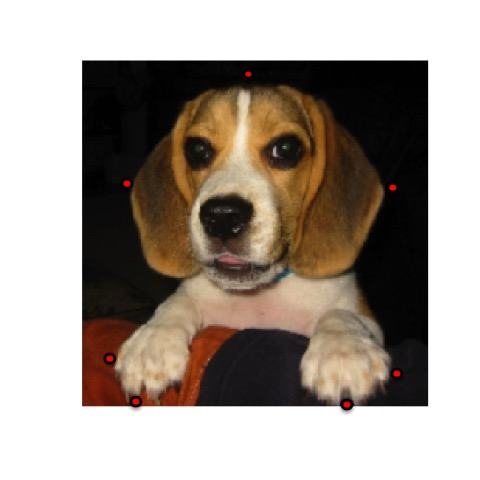
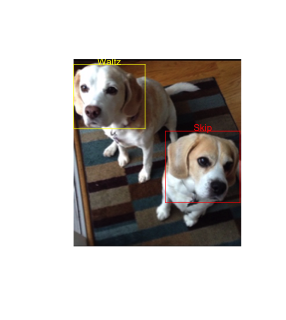

```{r setup, include = FALSE}
knitr::opts_chunk$set(
  collapse = TRUE,
  comment = "#>"
)
```

When we create bounding boxes in images, particularly if we intend to feed them into predictive models for object localization and classification, we are often:

* Processing many images
* Classifying the contents of the bounding boxes
* Standardizing the size of the images
* Capturing the coordinates


The **boundingbox** package supports these activities in efficient and effective ways:

* It allows you to stream your images from a directory for processing, in batches if desired.
* It allows you to set a common classifier for all images, or select a classifier per bounding box.
* It allows you to resize all of the output images to be the same size.
* It outputs a dataframe of the coordinates along with other metadata points.

This document explains when and how to use the two primary functions **boxer** and **boxer2** to generate bounding boxes, and the auxiliary function **outBox** to output the images. 


## boxer()

The **boxer** function allows you to stream through images (JPEG, PNG, BMP) from a directory.  Specifically, it will loop through the list of file names supplied in the vector assigned to the *names* parameter and load the corresponding image file from the directory indicated by the *file_path_input* parameter. As each image appears, indicate between 2 and 26 points around which **boxer** will calculate a bounding box. The name of the original file, the bounding box coordinates, and optional image resize values, classifier and box color are returned in a dataframe. **boxer** also offers the option to call the **outBox** function that will output each image with its bounding box to the directory captured by the *file_path_output* parameter. If outputting the images, the show_classifier parameter controls whether or not to show the class as a label above the bounding box.

### Function Definition
*boxer(names, file_path_input, color = "red", resize_x = NA, resize_y = NA, classifier = NA,  batch = length(names), outbox = FALSE, file_path_output = NA, show_classifier = FALSE)*

*names*: A vector that contains the names of JPG, PNG, or BMP image files;
*file_path_input*: The directory that contains the image files;
*color*: The name of the color for selected points  and the bounding box. Default is "red";
*resize_x*: Number of pixels to resize the x-axis. Default is NA to keep original size;
*resize_y*: Number of pixels to resize the y-axis. Default is NA to keep original size;
*classifier*: Character string to add a classifier. Default is NA;
*batch*: Number of images before prompt to truncate stream. Default is length(names);
*outbox*: Logical to run outBox and output images. Default is FALSE;
*file_path_output*: The directory where to save annotated images if outbox is TRUE;
*show_classifier*: Logical to include the classifier above the bounding box if outbox is TRUE. Default is FALSE.


### Example
``` {r, echo = TRUE, eval = FALSE}
box_coords <-
    boxer(
    names = c("S2.jpg", "W1.jpg"),
    file_path_input = system.file("extdata",    package = "boundingbox"),
    file_path_output = tempdir(),
    classifier = "dog",
    show_classifier = TRUE,
    resize_x = 224,
    resize_y = 224,
    outbox = TRUE
    )
```
When an image appears, use the left mouse button to select a point, and the right mouse button to signal completion and to move to the next image. To skip through any of the images, use the right mouse button prior to selecting any points with the left button. If the selected point goes out of the bounds of the image, the x and/or y coordinate is adjusted to the nearest set of coordinates on the inside edge of the image. 

Here is a screen shot of the first image with several points selected and the output file generated with a bounding box based on the selected points

```{r, echo = FALSE, out.width = "250px", fig.show = 'hold'}

knitr::include_graphics("README-output-1.jpg")
```

Here is a screen shot of the second image with two points selected and the output file generated with a bounding box based on the selected points

```{r, echo = FALSE, out.width = "250px", fig.show = 'hold'}
knitr::include_graphics("README-input-2.jpg")
knitr::include_graphics("README-output-2.jpg")
```

The resulting data frame will have the bounding box coordinates, the classifier, the image width and height, and box color for each of the images. Note that the y-coordinate extends from the top down, instead of the bottom up for these images. 

box_coords
```{r echo=FALSE, eval=TRUE}
box_coords <- data.frame(file_name = c("S2.jpg", "W1.jpg"), x_left = c(19,41), y_top = c(9,5), x_right = c(201, 149), y_bottom = c(223, 216), size_x = c(224, 224), size_y = c(224,224), classifier = "dog", color = "red", stringsAsFactors = FALSE)
box_coords
```

If there is a large number of images to stream through, consider using the batch parameter which will give an option to truncate the stream at the fixed interval set. Otherwise if in the middle of the stream and you do not want to continue, there are two options. One is to right mouse click to skip through the remaining images. The dataframe of coordinates will be produced at the end. The other alternative is to force close the image viewer (for example, X Windows System) in which case the function will not complete and the coordinates for the generated bounding boxes will not be produced. 

For example, if you are working with a 1000 images, you may want to set *batch = 100*. After you select the points to define the bounding box for the 100th image you will be prompted with:

>"Enter 1 if you want to truncate the stream or any other key to continue."

If you enter 1, **boxer** will return the dataframe with bounding box coordinates, output the images if *outbox = TRUE*, and then terminate. If you select any other key, **boxer** will continue to stream the next 100 images when you will be prompted again.

In the event you do truncate the process before you get to the last image and you want to pick up where you left off, be mindful of the following points. First, you will want to subset the vector of image file names such that it only includes the remaining images. Second, you will want to change the name you give to the output ("boxcoords" in the example above) so that you do not overwrite your earlier work. 


## boxer2()

The **boxer2** function operates in the same way as **boxer**, however, it gives you the option to add multiple bounding boxes per image, and to select the classifier per bounding box. To support the classifier selection, you need to provide a dataframe for the classifier parameter.

### Function Definition
*boxer2(names, file_path_input, color = "red", resize_x = NA, resize_y = NA, classifier,  batch = length(names), outbox = FALSE, file_path_output = NA, show_classifier = FALSE)*

Note the only difference in the definition of the function call between **boxer** and **boxer2** is that the *classifier* for **boxer2** does not have a default as a dataframe is required to be supplied.


### Example
``` {r, echo = TRUE, eval = FALSE}
dog_df <-
    data.frame(
    ref = (1:2),
    class = c("Skip", "Waltz"),
    color = c("red", "yellow"),
    stringsAsFactors = FALSE
    )
   
box_coords2 <-
    boxer2(
    names = c("SW1.png"),
    file_path_input = system.file("extdata",    package = "boundingbox"),
    file_path_output = tempdir(),
    classifier = dog_df,
    show_classifier = TRUE,
    outbox = TRUE
    )
```

After selecting the points for an image, you will be given the prompt below at which you enter the numeric "ref" value from the classifier dataframe that corresponds to the bounding box. 
> "Enter ref# for the classifier of this bounding box "

Then you will be given this prompt to confirm if you want to add another box to the same image or move on to the next.
>"Enter 1 to add bounding box to same image, any other key for next image "

Because the function pauses at each prompt, it will take more time to get through each image than with **boxer**.  If all of the images are of the same classifier and only one box per image, **boxer** is the more efficient function.

Output from **boxer2** with multiple bounding boxes and classifiers in one image.

```{r, echo = FALSE, out.width = "250px"}

```

box_coords2
```{r echo=FALSE, eval=TRUE}
box_coords2 <- data.frame(file_name = c("SW1.png", "SW1.png"), x_left = c(0, 157), y_top = c(9, 123), x_right = c(122, 284), y_bottom = c(110, 245), size_x = c(286, 286), size_y = c(320, 320), classifier = c("Waltz", "Skip"), color = c("yellow", "red"), stringsAsFactors = FALSE)
box_coords2
```


## outBox()

The **outBox** function generates the output images. It can be called by setting the parameter *outbox = TRUE* in **boxer** and **boxer2**. The output images will be generated to the directory indicated by the *file_path_output* parameter as the final step after the last image file is processed. Alternatively, you can keep the *outbox = FALSE* default when running **boxer** and **boxer2** and feed the output dataframe to **outBox** separately. This you may want to do if you need to amalgamate dataframes, edit the data in any way, or have another way to generate the bounding box coordinates. If your dataframe of bounding box coordinates was not generated by **boxer** or **boxer2**, it needs to be in the same format as if it were. See box_coord and box_coord2 as examples above.

### Function Definition
*outBox(points_master, file_path_input, file_path_output, show_classifier = FALSE)*

*points_master*:  A dataframe that captures the name of the image file, the four coordinates of the bounding box, the width and height dimensions of the image, the classifier, and the color for the label and box;
*file_path_input*: The directory that contains the image files;
*file_path_output*: The directory where to save annotated images;
*show_classifier*: Logical to include the classifier above the bounding box. The default is FALSE.

The format for **points_master** is a follows:
*file_name* : (chr) name of the image file;
*x_left*    : (int) left side x-coordinate;
*y_top*     : (int) top side y-coordinate;
*x_right*   : (int) right side x-coordinate;
*y_bottom*  : (int) bottom side y-coordinate;
*size_x*    : (int) image width in pixels;
*size_y*    : (int) image height in pixels;
*classifier*: (chr) classifier used as label;
*color*     : (chr) name of color to use for box and label.


###Example
``` {r, echo = TRUE, eval = FALSE}
points_master <-
    data.frame(read.csv(
    system.file("extdata", "points_example.csv",
    package = "boundingbox")
    ), stringsAsFactors = FALSE)
    

outBox(
    points_master = points_master,
    file_path_input = system.file("extdata", package = "boundingbox"),
    file_path_output = tempdir(),
    show_classifier = TRUE
    )
```


